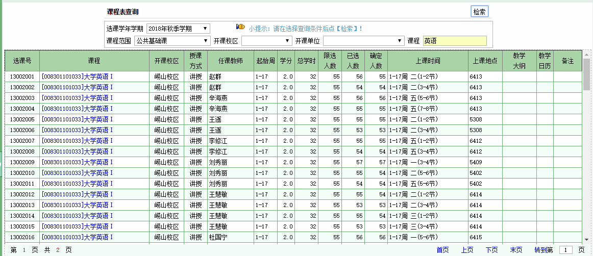

# OucFly——基于Java的中国海洋大学教务助手

<p align="center"></p>

<p align="center">
<a href="https://github.com/zqx123321/OucFly/blob/master/"></a>
<a href="https://www.travis-ci.org/zqx123321/OucFly)"></a>
<a href="https://github.com/zqx123321/OucFly#maven%E5%AF%BC%E5%85%A5"></a>
</p>

<p align="center"><h4 align="center">高性能、可拓展、功能齐全，全功率模式下开4线程爬取50人的信息只需1秒</h4></p>


# 目录

- [OucFly——基于Java的中国海洋大学教务助手](#oucfly基于java的中国海洋大学教务助手)
  - [1. 使用方式](#1-使用方式)
    - [maven导入](#maven导入)
    - [gradle导入](#gradle导入)
    - [lib导入](#lib导入)
  - [2. 快速开始](#2-快速开始)
  - [3. 日志使用](#3-日志使用)
  - [4. OucFly对象](#4-oucfly对象)
    - [Builder对象](#builder对象)
    - [工作模式](#工作模式)
      - [全功率模式](#全功率模式)
      - [校外模式](#校外模式)
      - [自定义模式](#自定义模式)
    - [工作线程](#工作线程)
    - [创建举例](#创建举例)
  - [5. Operator对象](#5-operator对象)
  - [6. Result对象](#6-result对象)
  - [7. 获取院系列表（Dept)](#7-获取院系列表（dept)
  - [8. 获取学生列表（StudentList)](#8-获取学生列表（studentlist)
  - [9. 获取学生学号（StudentCode）](#9-获取学生学号（studentcode）)
  - [10. 查找学生（Student）](#10-查找学生（student）)
  - [11. 获取成绩信息（GradeDetail）](#11-获取成绩信息（gradedetail）)
  - [12. 获取加权平均分(GradeScore)](#12-获取加权平均分gradescore)
  - [13. 获取专业排名（MajorOrder）](#13-获取专业排名（majororder）)
  - [14. 获取某门课的成绩排名（ClassOrder)](#14-获取某门课的成绩排名（classorder)
  - [15. 获取课表（ClassTable）](#15-获取课表（classtable）)
  - [16. 获取某门课某个学生投入的选课币（Coin)](#16-获取某门课某个学生投入的选课币（coin)
  - [17. 获取某门课所有选课学生投入的选课币（CoinClass）](#17-获取某门课所有选课学生投入的选课币（coinclass）)
  - [18. 获取考试安排](#18-获取考试安排)
  - [19. 根据名字查询课程信息](#19-根据名字查询课程信息)
  - [20. 二次开发指南](#20-二次开发指南)


## 1. 使用方式

### maven导入

```xml
<dependency>
    <groupId>cn.ouctechnology</groupId>
    <artifactId>oucfly</artifactId>
    <version>1.0.0</version>
</dependency>
```

### gradle导入

```java
repositories {
    mavenCentral()
    maven { url "https://raw.githubusercontent.com/zqx123321/OucFly/master/repository" }
}

dependencies {
    compile 'cn.ouctechnology:oucfly:1.0.0'
}
```

### lib导入

可以从 https://github.com/zqx123321/OucFly/blob/master/repository/cn/ouctechnology/oucfly/1.0.0/oucfly-1.0.0.jar 下载Jar包，导入后add as library即可

## 2. 快速开始

OucFly的使用方式非常简单，仅仅需要短短的几行代码，就能实现一个个强大的功能。

例如获取一个学生入学以来的所有成绩，只需要下面几行代码：

```java
//通过Builder来创建OucFly对象，传入学号和教务处密码
OucFly oucFly = OucFly.builder(userName, passWord).build();
//创建成绩详情功能单元
Operator operator = new GradeDetail(userCode);
//执行功能单元
Result result = oucFly.run(operator);
//判断是否成功
if (result.isSuccess()) {
    System.out.println(result.getContent());
}
```

再例如，获取一个人指定学期的课表，只需要将上述代码中的成绩详情功能单元GradeDetail换成课表的功能单元即可，其他代码完全一样：

```java
OucFly oucFly = OucFly.builder(userName, passWord).build();
//指定2018年秋季学期
Operator operator = new ClassTable(userCode, new XnXq(2018, XnXq.Xq.AUTUMN));
Result result = oucFly.run(operator);
if (result.isSuccess()) {
    System.out.println(result.getContent());
}
```

下面，我将详细介绍每个功能模块。

## 3. 日志使用

本系统使用Sl4j接口和Logback实现作为日志系统，日志会记录发送的http请求、携带的参数、运行时信息等，如果需要查看这些内容，请在resource目录下创建logback.xml或者logback-test.xml，并将日志级别调至trace或者info级别

## 4. OucFly对象

所有的功能单元必须都通过OucFly对象来执行，在**客户端**程序运行过程中，可以保证OucFly对象是单例的，但是系统并不保证程序运行时间足够长，以致于cookie过期后，能自动获取新的cookie

### Builder对象

OucFly对象必须通过建造者Builder对象来创建，创建有两个必填参数username和password，分别表示学号和教务处密码，此外，Builder还有工作模式和工作线程数两个可选参数

### 工作模式

教务处可用的入口有4个，分别是：

```java
JWGL_OUC_EDU_CN("http://jwgl.ouc.edu.cn/"),
JWGL_2_OUC_EDU_CN("http://jwgl2.ouc.edu.cn/"),
I_222_195_158_225("http://222.195.158.225/"),//只可以校内访问
I_222_195_158_206("http://222.195.158.206/");//只可以校内访问
```

与之相配合，OucFly提供了三种工作模式，由枚举类Mode指定，分别是：

```java
public enum Mode {
    FULL_POWER, //全功率工作模式，系统自动测试全部的四个URL，把可用的加入到主机set
    OUTSIDE_ONLY, //校外工作模式，由于四个URL中的后两个只能校外访问，校外全功率不可用
    ASSIGN_SELF;//用于自定义主机列表
}
```

#### 全功率模式

全功率模式（FULL_POWER）同时使用上述4个入口，效率最高，这也是系统默认的工作模式

#### 校外模式

校外模式（OUTSIDE_ONLY）只使用了可以在校外访问的前两个入口

#### 自定义模式

自定义模式（ASSIGN_SELF）允许用于自己制定系统可用的入口

### 工作线程

OucFly默认只使用一个线程进行工作，当执行获取选课币或者院系排名等非常耗时的操作时，可以通过方法thread来指定多个线程，推荐线程数为运行系统的CPU数量，多了会增加线程切换的开销，得不偿失

### 创建举例

下面列举了常见的创建方式：

最简单：

```java
OucFly oucFly = OucFly.builder(userName, passWord)
        .build();
```

全功率多线程：

```java
OucFly oucFly = OucFly.builder(userName, passWord)
        .mode(Mode.FULL_POWER)
        .thread(4)
        .build();
```
指定Host：

```java
OucFly oucFly = OucFly.builder(userName, passWord)
        .addHost(Host.JWGL_OUC_EDU_CN)
        .addHost(Host.JWGL_2_OUC_EDU_CN)
        .build();
```

## 5. Operator对象

功能单元的总父类，所有的操作均是它的子类，所有功能组件的全家福如下：


需要拓展功能的时候，只需要继承Operator抽象类，实现run方法即可

此外，虽然鼓励采用面向接口编程的方式：

```java
Operator operator = new GradeDetail(userCode);
Result result = oucFly.run(operator);
```

但是在本系统中，更建议直接使用具体类的引用，而不是Opertor父类引用，因为这样不会出现泛型的擦除，能切切实实地知道返回值的类型：

```java
GradeDetail operator = new GradeDetail(userCode);
Result<List<GradeDetailEntity>> result = oucFly.run(operator);
```

## 6. Result对象

所有功能操作的返回结果均是带有泛型的Result对象，Result对象中有如下字段，可以用来判断操作是否执行成功，获取操作执行结果以及错误信息等


## 7. 获取院系列表（Dept)

获取学院信息：

```java
//创建院系列表过滤器，必须指定年级
DeptFilter deptFilter = new DeptFilter(2015);
//创建工作单元
Dept dept = new Dept(deptFilter);
Result<List<DeptEntity>> run = oucFly.run(dept);
```

获取专业信息，可以指定学院代码，也可以设置学院名字让系统自动寻找学院代码

```java
//1、指定学院代码
DeptFilter deptFilter = new DeptFilter(2015)
        .setDept("0010");
//2、设置学院的名字，系统将自动寻找学院代码，支持模糊搜索
DeptFilter deptFilter = new DeptFilter(2015)
        .filterDept("信息");
//创建工作单元
Dept dept = new Dept(deptFilter);
Result<List<DeptEntity>> run = oucFly.run(dept);
```

获取班级信息，可以指定专业代码，也可以设置专业名字让系统自动寻找专业代码

```java
//1、指定专业代码
DeptFilter deptFilter = new DeptFilter(2015)
        .setDept("0010")
        .setMajor("0096");
//2、设置专业的名字，系统将自动寻找专业代码，支持模糊搜索
DeptFilter deptFilter = new DeptFilter(2015)
        .filterDept("信息")
        .filterMajor("保密");
//创建工作单元
Dept dept = new Dept(deptFilter);
Result<List<DeptEntity>> run = oucFly.run(dept);
```

返回值为DeptEntity的列表：

```java
@Data
public class DeptEntity {
    //院系（专业）名称
    private String name;
    //院系（专业）代码
    private String code;
}
```

**如果使用模糊匹配需要保证匹配结果的唯一性，如果不唯一程序会抛出异常，告知调用者重复项有哪些，进而可以让调用者进行更精确的匹配**

## 8. 获取学生列表（StudentList)

此功能可以获取一个院系中的学生信息或者一门课选课学生的信息，创建需要传入一个过滤器StudentFilter，StudenFilter是一个抽象类，它有两个子类：StudentDeptFilter和StudentClassFilter，分别表示获取院系学生信息和选课学生信息

获取某个院系中的学生信息：

```java
//创建学生院系过滤器，通过名字
StudentFilter filter = new StudentDeptFilter(2015)
    	.filterDept("信息")
        .filterMajor("保密");
//创建学生院系过滤器，通过代码
StudentFilter filter = new StudentDeptFilter(2015)
    	.setDept("0010")
        .setMajor("0096");
StudentList studentList = new StudentList(filter);
Result<List<StudentEntity>> result = oucFly.run(studentList);
```

获取某一门课的选课学生名单：

```java
//创建StudentClassFilter，传入学年学期和8位的选课号
StudentFilter filter = new StudentClassFilter(new XnXq(2018, XnXq.Xq.AUTUMN), classCode);
StudentList studentList = new StudentList(filter);
Result<List<StudentEntity>> result = oucFly.run(studentList);
```

返回为StudentEntity列表：

```java
@Data
public class StudentEntity {
    //年级
    private int grade;
    //学号
    private String code;
    //姓名
    private String name;
    //性别
    private String sex;
    //所在学院
    private String dept;
    //所在专业
    private String major;
}
```

## 9. 获取学生学号（StudentCode）

此功能单元与上一个获取学生列表相似，只是返回的结果中只有学号，不带有其他冗余信息，此功能单元适合作为中间结果为更高级的功能单元服务，比如获取院系排名、获取课程选课币等操作均需要先执行此功能获取学号后再执行下一步操作

## 10. 查找学生（Student）

此功能单元可以根据学号或者姓名查找匹配的学生信息

可以设置一个过滤器StudentFilter来表示查找某个院系或者某门课中的学生，如果没有这个过滤器，系统会全盘扫描在校的所有学生

**没错，是所有的在校学生，4个年级，所有学院，所以不建议每次都使用此功能单元进行在线查询，更加推荐的做法是先提前把所有的学生都获取出来，然后存入数据库进行离线查询，即通过sql: select * from student where usercode='xxx' 或者select * from student where username like'%xxx%' 来获取学生数据**

**如果必须要使用此功能进行在线查询，请尽量设置一个过滤器来缩小查询范围，如果真的没有过滤器，请一定使用全功率模式下并且开启多个线程防止运行时间过长**

应用举例：

查找信息学院中姓名为张三的学生：

```java
StudentDeptFilter deptFilter = new StudentDeptFilter(2015).filterDept("信息");
Student student = new Student(deptFilter).setUserName("张三");
Result<List<StudentEntity>> result = oucFly.run(student);
if (result.isSuccess()) {
    System.out.println(result.getContent());
}
```

查找选修选课号为456这门课中学号为123的学生：

```java
//2018秋季学期，选课号为123
StudentClassFilter classFilter = new StudentClassFilter(
        new XnXq(2018, XnXq.Xq.AUTUMN), "456");
Student student = new Student(classFilter).setUserCode("123");
Result<List<StudentEntity>> result = oucFly.run(student);
if (result.isSuccess()) {
    System.out.println(result.getContent());
}
```
全盘查找叫做张三的学生：

```java
Student student = new Student().setUserName("张三");
Result<List<StudentEntity>> result = oucFly.run(student);
if (result.isSuccess()) {
    System.out.println(result.getContent());
}
```
## 11. 获取成绩信息（GradeDetail）

此功能可以获取任意一个学生的成绩信息，可以设置学年学期，入学以来等等，比如：

获取学号为123的同学2016年春季学期的成绩信息：

```java
GradeDetail gradeDetail = new GradeDetail(
        "123", new XnXq(2016, XnXq.Xq.SPRING));
Result<List<GradeDetailEntity>> result = oucFly.run(gradeDetail);
if (result.isSuccess()) {
    System.out.println(result.getContent());
}
```

获取学号为123的同学入学以来所有的成绩信息：

```java
GradeDetail gradeDetail = new GradeDetail("123");
Result<List<GradeDetailEntity>> result = oucFly.run(gradeDetail);
if (result.isSuccess()) {
    System.out.println(result.getContent());
}
```

返回结果为GradeDetailEntity的列表：

```java
@Data
public class GradeDetailEntity {
    //课程名称
    private String name;
    //课程学分
    private float score;
    //课程类型
    private String type;
    //取得分数
    private float grade;
    //获取方式（初修、重修、缓考）
    private String mode;
}
```

## 12. 获取加权平均分(GradeScore)

此功能可以获取任意一个学生的成绩信息，可以设置学年、学年学期、入学以来等等，比如：

获取学号为123的同学2016年春季学期取得成绩的加权平均分：

```java
GradeScore gradeScore = new GradeScore(
        "123", new XnXq(2016, XnXq.Xq.SPRING));
Result<GradeScoreEntity> result = oucFly.run(gradeScore);
if (result.isSuccess()) {
    System.out.println(result.getContent());
}
```

获取学号为123的同学入学以来所有的成绩的加权平均分：

```java
GradeScore gradeScore = new GradeScore("123");
Result<GradeScoreEntity> result = oucFly.run(gradeScore);
if (result.isSuccess()) {
    System.out.println(result.getContent());
}
```

获取学号为123的同学2016学年取得成绩的加权平均分，**用于开学初评选奖学金**

```java
GradeScore gradeScore = new GradeScore("123", 2016);
Result<GradeScoreEntity> result = oucFly.run(gradeScore);
if (result.isSuccess()) {
    System.out.println(result.getContent());
}
```

返回为GradeScoreEntity实体：

```java
@Data
public class GradeScoreEntity {
    //学号
    private String userCode;
    //姓名
    private String userName;
    //专业
    private String major;
    //总学分
    private float score;
    //加权平均分
    private float grade;
}
```

## 13. 获取专业排名（MajorOrder） 

此功能可以获取某个专业的排名，可以指定学年，学期，入学以来等，创建此类需要一个院系过滤器StudentDeptFilter来选择是哪个专业，上文中已经介绍过这个类了，例如：

获取2015级保密管理专业入学以来的成绩排名：

```java
StudentDeptFilter filter = new StudentDeptFilter(2015)
        .filterDept("信息").filterMajor("保密");
MajorOrder majorOrder = new MajorOrder(filter);
Result<OrderEntity> result = oucFly.run(majorOrder);
if (result.isSuccess()) {
    System.out.println(result.getContent());
}
```

获取2015级保密管理2016年秋季学期的成绩排名：

```java
StudentDeptFilter filter = new StudentDeptFilter(2015)
        .filterDept("信息").filterMajor("保密");
MajorOrder majorOrder = new MajorOrder(
        filter, new XnXq(2016, XnXq.Xq.SPRING));
Result<OrderEntity> result = oucFly.run(majorOrder);
if (result.isSuccess()) {
    System.out.println(result.getContent());
}
```

获取2015级保密管理2016学年的成绩排名：

```java
StudentDeptFilter filter = new StudentDeptFilter(2015)
        .filterDept("信息").filterMajor("保密");
MajorOrder majorOrder = new MajorOrder(filter, 2016);
Result<OrderEntity> result = oucFly.run(majorOrder);
if (result.isSuccess()) {
    System.out.println(result.getContent());
}
```

返回结果为OrderEntity实体：

```java
@Data
public class OrderEntity {
    //该专业全部人数
    private int all;
    //获取成功的人数
    private int success;
    //数据
    private List<GradeScoreEntity> data;
}
```

**此功能返回结果没有进行任何排序操作，此功能可以使用多线程进行，如果需要，可以在创建OucFly对象的时候指定多线程，另外，此功能需要发送大量请求，并且不保证全部成功，请通过返回结果中的all与success来判断成功数**

## 14. 获取某门课的成绩排名（ClassOrder)

此功能可以获取选修某门课的同学这门课程的成绩信息，必须在这门课出成绩后才能查询到，例如获取2016年春季学期选课号为456的这门课的成绩信息：

```java
ClassOrder classOrder = new ClassOrder(new XnXq(2016, XnXq.Xq.SPRING), "456");
Result<OrderEntity> result = oucFly.run(classOrder);
if (result.isSuccess()) {
    System.out.println(result.getContent());
}
```

**此功能返回结果没有进行任何排序操作，与上一个功能不同，此功能能够保证获取到所有选课学生的成绩**

## 15. 获取课表（ClassTable） 

此功能可以获取任意一个学生任意一个学期的课表信息，例如

获取学号为123的同学2016年春季学期的课表：

```java
ClassTable classTable = new ClassTable(
        "123", new XnXq(2016, XnXq.Xq.SPRING));
Result<List<List<List<ClassTableEntity>>>> result = oucFly.run(classTable);
if (result.isSuccess()) {
    System.out.println(result.getContent());
}
```

**返回类型是一个ClassTableEntity的三维数组，如下图所示，三维数组的第一维代表行，第二维代表列，第三维代表一个格子中的多门课程（可能不止一门）**


ClassTableEntity实体内容为：

```java
@Data
public class ClassTableEntity {
    //课程名称
    private String className;
    //授课老师
    private String classTeacher;
    //上课时间
    private String classTime;
    //上课地点
    private String classPlace;
    //其他备注信息
    private String classInfo;
}
```

## 16. 获取某门课某个学生投入的选课币（Coin)

此功能可以查询某一门课某个学生选这门课投入的选课币，此功能经常作为中间操作为查询某门课所有学生的选课数据所服务，例如查询学号为123的学生给2016年春季学期选课号为456的这门课投入的选课币：

```java
Coin coin = new Coin("123", "456",
        new XnXq(2016, XnXq.Xq.SPRING));
Result<CoinEntity> result = oucFly.run(coin);
if (result.isSuccess()) {
    System.out.println(result.getContent());
}
```

返回结果为CoinEntity实体：

```java
@Data
public class CoinEntity {
    //学生学号
    private String userCode;
    //该学生投入的选课币
    private int coin;
}
```

## 17. 获取某门课所有选课学生投入的选课币（CoinClass）

此功能可以获取某一门课所有选课学生投入的选课币，创建需要制定学年学期和8位的选课号，例如获取2016年春季学期选课号为456的这门课所有选课学生的选课情况：

```java
CoinClass coinClass = new CoinClass(
        "456", new XnXq(2016, XnXq.Xq.SPRING));
Result<CoinClassEntity> result = oucFly.run(coinClass);
if (result.isSuccess()) {
    System.out.println(result.getContent());
}
```

返回内容为CoinClassEntity实体：

```java
@Data
public class CoinClassEntity {
    //全部选课人数
    private int all;
    //获取成功的人数
    private int success;
    //数据
    private List<CoinEntity> data;
}
```

**此功能返回结果没有进行任何排序操作，此功能可以使用多线程进行，如果需要，可以在创建OucFly对象的时候指定多线程，另外，此功能需要发送大量请求，并且不保证全部成功，请通过返回结果中的all与success来判断成功数**

## 18. 获取考试安排（Exam）

此功能可以获取任意一个学生任意一个学期的考试安排，创建此对象需要一个枚举对象，用来表示期中期末还是补缓考:

```java
//期中期末缓考类型枚举
public enum ExamType {
    MID(3),     //期中考试
    FINAL(2),   //期末考试
    MAKE_UP(1); //开学初补缓考
    private int code;

    ExamType(int code) {
        this.code = code;
    }
}
```

例如，获取学号为123的同学2018年秋季学期期末考试安排：

```java
Exam exam = new Exam("123",
        new XnXq(2018, XnXq.Xq.AUTUMN), Exam.ExamType.FINAL);
Result<List<ExamEntity>> result = oucFly.run(exam);
if (result.isSuccess()) {
    System.out.println(result.getContent());
}
```

获取学号为123的同学2018年秋季学期期中考试安排：

```java
Exam exam = new Exam("123",
        new XnXq(2018, XnXq.Xq.AUTUMN), Exam.ExamType.MID);
Result<List<ExamEntity>> result = oucFly.run(exam);
if (result.isSuccess()) {
    System.out.println(result.getContent());
}
```

返回为ExamEntity的列表：

```java
@Data
public class ExamEntity {
    //课程名称
    private String className;
    //课程学分
    private String classScore;
    //课程类型
    private String classType;
    //课程号
    private String classCode;
    //考核方式
    private String examMethod;
    //考试时间
    private String examTime;
    //考试地点
    private String examPlace;
    //考试座号
    private String examSeat;
    //考试方式（统一、非同一、提前等）
    private String examType;
}
```

## 19. 根据名字查询课程信息（Query）

此功能实现的是教务处中的"教务处查询"功能，如下图所示：



创建此对象需要一个枚举对象，表示是专业课还是公共基础课还是通识选修课：

```java
public enum ClassType {
    //公共基础课
    PUBLIC_BASIC("PublicBasic"),
    //专业课
    SPECIALTY("Specialty"),
    //通识选修课
    COMMON("Common");
    private String name;

    ClassType(String name) {
        this.name = name;
    }
}
```

创建此对象需要传入学年学期和要查询的课程名字，支持模糊搜索，如果查询结果一页容纳不下的话，需要使用setCurrentPage方法手动翻页，此功能单元通常在不知道选课号只知道课程名字的情况下用来查询到选课号，再做其它操作，例如：

查询2016年春季学期名字包含“英语”的公共基础课：

```java
Query query = new Query(new XnXq(2016, XnXq.Xq.SPRING),
        Query.ClassType.PUBLIC_BASIC, "英语");
Result<List<QueryEntity>> result = oucFly.run(query);
if (result.isSuccess()) {
    System.out.println(result.getContent());
}
```

查询2016年春季学期名字包含“计算机”的专业课，并翻到第二页：

```java
Query query = new Query(new XnXq(2016, XnXq.Xq.SPRING),
        Query.ClassType.SPECIALTY, "计算机").setCurrentPage(2);
Result<List<QueryEntity>> result = oucFly.run(query);
if (result.isSuccess()) {
    System.out.println(result.getContent());
}
```

返回为QueryEntity的列表：

```java
@Data
public class QueryEntity {

    //课程选课号
    private String classCode;
    //课程所在校区
    private String classSchool;
    //授课老师
    private String classTeacher;
    //起始周
    private String teacherWeek;
    //课程学分
    private Float classScore;
    //总学时
    private Integer classHour;
    //限选人数
    private Integer limitPeople;
    //已选人数
    private Integer allPeople;
    //确定人数
    private Integer countPeople;
    //上课时间，可能有多个时间
    private List<String> classTime;
    //上课地点，可能有多个地点
    private List<String> classPlace;
}
```

## 20. 二次开发指南

利用本系统进行二次开发非常简单，只需要定义一个类继承自Operator抽象类，指定返回结果的泛型，再实现run方法就可以了

发送请求使用OkHttpUtil中提供的方法，get和post请求参数均需要以HttpParams抽象类的子类的形式出现，HttpParams抽象类中定义了两个方法，toFormBody和toString，分别用于post和get方法，自定义的请求参数类只需要继承这个抽象类，定义参数字段就可以了

解析相应内容可以使用正则匹配和Jsoup查询，推荐使用Jsoup查询

最后，通过OucFly对象的run方法启动自定义的功能单元即可
